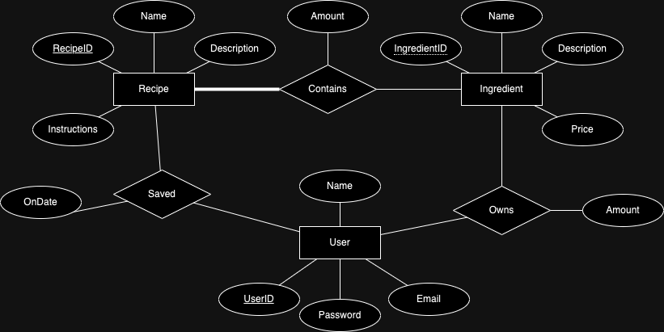

# MXLGY Design
## Intended user experience

We want to help our users make cocktails. 

Our database contains recipes for cocktails, and the ingredients that the recipes contain. It also stores information about users: who they are, what cocktails they like, and what ingredients they own. Users should be able to browse recipes and ingredients in order to save recipes they like and mark ingredients as owned.

Users can use our app to keep track of ingredients they own. Then, the app should be able to tell them what cocktails they can make. Moreover, Users should be able to use our app to find and select cocktail recipes that they like. Then, based on the ingredients they have and a budget they input, our app should be able to make suggestions about what ingredients they should buy next in order to be able to make more cocktails that they like. 

## Preliminary Entity Relationship model
Entities
- Users
- Recipes
- Ingredients

Relations
- User owns Ingredients (and what amount)
- Recipe contains Ingredients (and what amount)
- User saved a recipe (and the date saved)

### ER Diagram

## Our Data
- We have taken our data from [TheCocktailDB](https://www.thecocktaildb.com/)'s API
- 

## Implementation Plan

### Frontend
- For the frontend, we are planning on using modern web frameworks and libraries such as React and TailwindCSS.

### Backend

